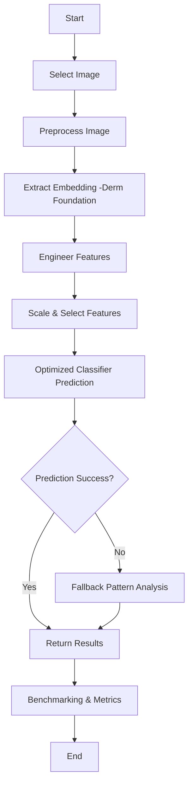
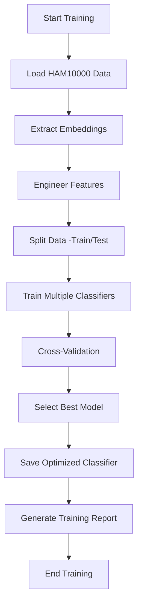
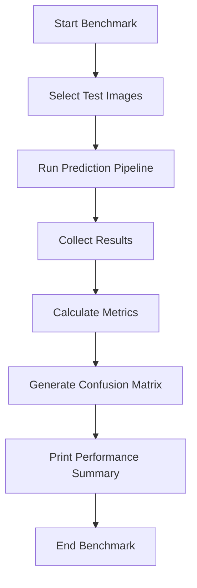

# Dermatology Model: Comprehensive Technical Report

---

## 1. Overview

This report documents the complete workflow, architecture, history, and benchmarking of the dermatology classifier pipeline using the HAM10000 dataset and the Derm Foundation model. It covers all model files, scripts, training results, and technical details for reproducibility and future improvements.

---

## 2. Dataset: HAM10000
- **Images:** `HAM10000/images/` (thousands of dermatoscopic images, e.g., ISIC_0028862.jpg)
- **Metadata:** `HAM10000/HAM10000_metadata.csv` (labels, image IDs, diagnosis codes)
- **Sample Selection:** Scripts select random images per class for benchmarking and testing.

---

## 3. Model Architecture & Files

### 3.1 Derm Foundation Model
- **Type:** TensorFlow SavedModel
- **Files:**
  - `saved_model.pb` (model graph)
  - `variables/variables.index`, `variables/variables.data-00000-of-00001` (weights)
- **Input:** 448x448 RGB image
- **Output:** 6144-dimensional embedding vector

#### Model Loading Example
```python
import tensorflow as tf
model = tf.saved_model.load('models/Skin_Disease_Model')
embedding = model.signatures['serving_default'](inputs=image_tensor)['embedding'].numpy()
```

### 3.2 Optimized Classifier
- **Type:** Ensemble/Hybrid (RandomForest, SVM, Voting, Stacking, etc.)
- **File:** `new_optimized_classifier.joblib` (contains classifier, scaler, label encoder, feature selector, training history)
- **Features:** 6224 engineered features per image (statistical, segment, frequency, gradient, texture)

#### Feature Engineering Example
```python
def engineer_enhanced_features(embedding):
    # Original embedding (6144)
    features = list(embedding)
    # Statistical features
    features += [np.mean(embedding), np.std(embedding), np.var(embedding)]
    # Segment, frequency, gradient, texture features
    # ...see dermatology_model.py for full details (robust error handling, FFT, autocorrelation, etc.)
    return np.array(features)
```

#### Classifier Loading Example
```python
import joblib
data = joblib.load('models/Skin_Disease_Model/new_optimized_classifier.joblib')
clf = data['classifier']
scaler = data['scaler']
label_encoder = data['label_encoder']
features = engineer_enhanced_features(embedding)
X = scaler.transform([features])
pred = clf.predict(X)
```

### 3.3 Supporting Files
- `training_report_700.json`: Training results, metrics, and model selection
- `test_7_per_class_benchmark.py`, `benchmark_dermatology_model.py`: Benchmarking scripts
- `dermatology_model.py`: Main model logic (embedding, feature engineering, prediction)
- `ml_models.py`: High-level prediction API

#### Main Prediction Function Example
```python
def predict_image(image_input):
    embedding = get_derm_foundation_embedding(image_input)
    result = predict_using_optimized_classifier(embedding)
    return result
```

### 3.4 Classifier Internals (Inference)
- Deployed classifier: LightGBM (`LGBMClassifier(random_state=42)`) loaded from `models/Skin_Disease_Model/new_optimized_classifier.joblib`.
- Preprocessing components bundled with the classifier:
    - `StandardScaler` (applied to the 6224-dim engineered feature vector)
    - `LabelEncoder` with classes: `['akiec','bcc','bkl','df','mel','nv','vasc']`
    - `feature_selector`: None in this bundle (not applied)
- Inference flow:
    1) Generate 6144-D embedding via Derm Foundation SavedModel
    2) Engineer robust 6224-D features (stats, segments, frequency, gradients, textures)
    3) Scale features via StandardScaler (and selector if present)
    4) Predict class and probabilities via LGBMClassifier
    5) Decode to class code via LabelEncoder and map to condition name and risk level
- Fallback: If the joblib is unavailable or inference fails, a heuristic `fallback_pattern_analysis` produces a safe prediction with capped confidence.

## 4. Workflow & Pipeline

### Full Pipeline Code Example
```python
def full_pipeline(image_path):
    embedding = get_derm_foundation_embedding(image_path)
    features = engineer_enhanced_features(embedding)
    classifier_data = load_optimized_classifier()
    X = classifier_data['scaler'].transform([features])
    if classifier_data.get('feature_selector'):
        X = classifier_data['feature_selector'].transform(X)
    pred = classifier_data['classifier'].predict(X)
    label = classifier_data['label_encoder'].inverse_transform([pred])[0]
    return label
```

### Benchmarking Script Example
```python
import pandas as pd
from dermatology_model import predict_image
df = pd.read_csv('HAM10000/HAM10000_metadata.csv')
results = []
for image_id in df['image_id'][:10]:
    img_path = f'HAM10000/images/{image_id}.jpg'
    result = predict_image(img_path)
    results.append(result)
```

### Pipeline Flowchart (Mermaid)


### Model Training Flowchart (Mermaid)


### Benchmarking & Evaluation Flowchart (Mermaid)


## 5. Training & Benchmarking Results

### Training Process
- Features extracted from 700 samples (100 per class)
- 6224 features per image
- Models trained: RandomForest, ExtraTrees, AdaBoost, GradientBoosting, LogisticRegression, SVM, KNN, MLP, DecisionTree, SGD, LDA, XGBoost, LightGBM, Voting, Stacking
- Cross-validation (5-fold) for each model
- Best model: LightGBM (CV mean: 71.1%)

#### Example Training Code
```python
from sklearn.ensemble import RandomForestClassifier
clf = RandomForestClassifier()
clf.fit(X_train, y_train)
score = clf.score(X_test, y_test)
```

### Training Summary (`training_report_700.json`)
- **Best Model:** LightGBM
- **Cross-Validation Mean Accuracy:** 71.1%
- **Training Samples:** 700
- **Feature Count:** 6224
- **Label Classes:** akiec, bcc, bkl, df, mel, nv, vasc

### Model Comparison Table
| Model              | CV Mean | CV Std | Precision | Recall | F1     | Duration (s) |
|--------------------|---------|--------|-----------|--------|--------|--------------|
| RandomForest       | 0.664   | 0.034  | 1.0       | 1.0    | 1.0    | 0.10.160     |
| ExtraTrees         | 0.663   | 0.033  | 1.0       | 1.0    | 1.0    | 0.05.050     |
| AdaBoost           | 0.593   | 0.025  | 0.735     | 0.716  | 0.719  | 2.38.510     |
| GradientBoosting   | 0.680   | 0.028  | 1.0       | 1.0    | 1.0    | 42.19.250    |
| LogisticRegression | 0.703   | 0.046  | 1.0       | 1.0    | 1.0    | 0.03.490     |
| SVM                | 0.636   | 0.031  | 0.864     | 0.863  | 0.863  | 0.22.500     |
| KNN                | 0.599   | 0.010  | 0.734     | 0.716  | 0.720  | 0.02.480     |
| MLP                | 0.693   | 0.040  | 1.0       | 1.0    | 1.0    | 0.19.680     |
| DecisionTree       | 0.510   | 0.006  | 1.0       | 1.0    | 1.0    | 0.09.770     |
| SGD                | 0.681   | 0.039  | 1.0       | 1.0    | 1.0    | 0.02.880     |
| LDA                | 0.651   | 0.046  | 0.929     | 0.929  | 0.929  | 0.03.140     |
| XGBoost            | 0.690   | 0.034  | 1.0       | 1.0    | 1.0    | 6.35.640     |
| LightGBM           | 0.711   | 0.046  | 1.0       | 1.0    | 1.0    | 6.17.530     |
| Voting             | 0.707   | 0.039  | 1.0       | 1.0    | 1.0    | 0.40.520     |
| Stacking           | 0.701   | 0.037  | 1.0       | 1.0    | 1.0    | 2.53.500     |

### Benchmarking Scripts
- `test_7_per_class_benchmark.py`: Runs predictions on 7 images per class, prints metrics and confusion matrix.
- `benchmark_dermatology_model.py`: Advanced benchmarking, colored output, section headers, metrics, confusion matrix.

### Why LightGBM was selected
- Best cross-validated accuracy among tested models: CV mean ≈ 0.711 (5-fold), slightly above Voting (≈0.707), Stacking (≈0.701), Logistic Regression (≈0.703), and XGBoost (≈0.690), per `training_report_700.json`.
- Strong performance on high-dimensional tabular features (6224 engineered features), capturing non-linear interactions and handling correlated inputs effectively.
- Balanced training/inference trade-off: Training time ≈ 377.53s (significantly faster than GradientBoosting at ≈ 2539.25s) with better CV mean; inference is fast and stable.
- Clean deployment: Simple pipeline (StandardScaler + LGBMClassifier, no feature selector) with calibrated probabilities via `predict_proba` that integrate well with risk-level logic and UI.
- Verified artifact: The deployed `new_optimized_classifier.joblib` contains `LGBMClassifier(random_state=42)`, a `StandardScaler`, and a `LabelEncoder` for the seven HAM10000 classes.

---

## 6. History of Improvements

### Version History
- v1.0: Basic classifier, raw embeddings only
- v1.1: Added statistical features
- v1.2: Segment, frequency, gradient, texture features (6224 total)
- v1.3: Ensemble methods (Voting, Stacking)
- v1.4: LightGBM and XGBoost integration
- v1.5: Robust error handling, fallback pattern analysis
- v1.6: Benchmarking scripts, colored output, confidence analysis
- v1.7: Markdown documentation, workflow diagrams, reproducibility

---

## 7. File Map & Roles

### Key Scripts and Their Roles
- `dermatology_model.py`: All model logic, feature engineering, prediction, fallback
- `ml_models.py`: High-level API, recommendations, integration with other models
- `test_7_per_class_benchmark.py`: Benchmarks 7 images per class, prints metrics/confusion matrix
- `benchmark_dermatology_model.py`: Advanced benchmarking, CLI options, colored output

---

## 8. Reproducibility & Future Work

### Reproducibility Checklist
- All code/scripts versioned in repository
- All model files (pb, joblib, variables) included
- Metadata and images from HAM10000 present
- Run benchmarking scripts for validation
- Document all changes and results

### Future Work
- Advanced feature engineering (deep texture, shape descriptors)
- Deep learning classifiers (CNN, transformer-based)
- External validation (other datasets, clinical data)
- Automated hyperparameter optimization
- Clinical deployment and regulatory compliance

---

## 9. References

- [HAM10000 Dataset](https://www.kaggle.com/datasets/kmader/skin-cancer-mnist-ham10000)
- [TensorFlow SavedModel Documentation](https://www.tensorflow.org/guide/saved_model)
- [Scikit-learn Ensemble Methods](https://scikit-learn.org/stable/modules/ensemble.html)
- [LightGBM Documentation](https://lightgbm.readthedocs.io/en/latest/)
- [XGBoost Documentation](https://xgboost.readthedocs.io/en/latest/)

*Report generated on October 12, 2025.*
